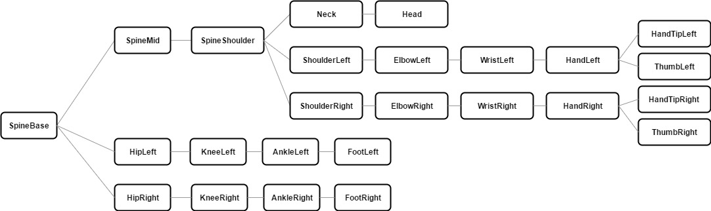

## float CurrentState::angleSizeCalc(EMMA::Joints jointNumber)
This function calculates the angle expanded by the 2 vectors from selected joint to its 2 neighboring joint. 
* @param jointNumber the joint number which should be calculated. The invalid numbers are: 0, 3, 15, 19, 20, 21, 22, 23, 24, because they are root or end joints.
* @return the size of the given angle(jointNumber) with value from 0 to 180 degree.

## JointRelativeAngles anglesInRelativeCoordinateSystem()

This function calculates the angles between parent->child and x-/y-/z-axis.
The Hierarchy of joints:

The coordination system of "Relative to parent joint" is defined in the [website of iPi Soft](http://docs.ipisoft.com/iPi_Biomech_Add-on)
- Y-Axis is vertical to the floor(XZ plane).
- X-Axis is directed along left arm in 
  (source: [iPi_Biomech_Add-on](http://docs.ipisoft.com/iPi_Biomech_Add-on))
- Center/Origine coincides with the coordinates of the parent joint.

@return JointRelativeAngles, which is a QMap<uint, Angles3D>. 
Anggles3D has 3 values: x, y and z, which coresponds to the angle between parent->child and x-axis, the angle between parent->child and y-axis and the angle between parent->child and z-axis.

