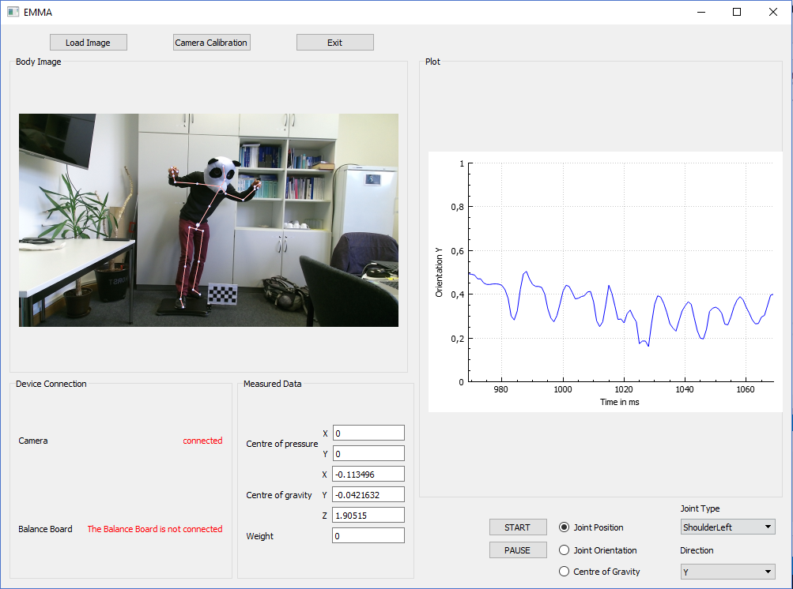

# Entwicklung eines mobilen, markerlosen Bewegungsanalysesystems

## System requirements

Qt5 needs to be installed and

### Kinect Sensor v2.0 (for XBox One, with Windows adapter)

Get started by installing Visual Studio, Kinect SDK 2.0 (ships with Runtime 2.0) and following the [Kinect for Windows Programming Guide](https://msdn.microsoft.com/en-us/library/dn782037.aspx). You’re also advised to take a look at the Body Basics-D2D sample by going to [Project/Solution](https://msdn.microsoft.com/en-us/library/dn782040.aspx).

- Hardware Requirements:
    - USB 3.0, preferably Intel or NEC host controller ([source](https://github.com/OpenKinect/libfreenect2))
- Required drivers
    - [Kinect for Windows Runtime v2.0](https://www.microsoft.com/en-us/download/details.aspx?id=44559)
      - runs on Windows 8, 8.1, 10 (~~you might want to consider using Windows to go with the RWTH licene from Microsoft Imagine, but consider the required disk space for Visual Studio!~~ → didn’t work on Windows to go until now)

## Wii Balance Board

- Requires Bluetooth (bluez on linux) (EMMA uses the [wiiuse library](https://github.com/rpavlik/wiiuse))

## Building from source

Refer to [BUILDING.md](BUILDING.md)

## Using the collected data
    
### AnyBody

Multi-body human biomechanics simulation tool; Some researchers at the HIA are interested in using in the future.

http://www.anybodytech.com/

One alternative open tool is [OpenSim](http://simtk-confluence.stanford.edu:8080/display/OpenSim/User%27s+Guide)

## License

Although all other components are GPL-3-compatible, the Kinect Library is licensed under the
[Microsoft Kinect for Windows SDK EULA]
(http://download.microsoft.com/download/0/D/C/0DC5308E-36A7-4DCD-B299-B01CDFC8E345/Kinect-SDK2.0-EULA_en-US.pdf)
which is probably not compatible with any Opensource license. This application
can be built without Kinect, if you’re only interested in using the other
parts.

In particular the following components are used:

* Qt (GPL 3 and LGPL 3)
* QCustomPlot (GPL 3)
* QtOpenCV (MIT)
* inih (BSD-3-Clause)
* text-csv (Boost License)
* wiiuse (GPL 3)
